## Team members:
- Najla Alsowayed
- Deema Alkhudairi
- Majed Alshnifi

# Introduction to the Real Estate Database

Imagine you're looking to buy a villa in Riyadh, Saudi Arabia. You've been searching for weeks, scrolling through endless listings online, but you're still not sure what you're looking for. That's where our project comes in.
We've taken on the task of analyzing the Riyadh villas dataset, which contains information about various villas located in Riyadh. We want to help you make an informed decision about your purchase by providing insights into the real estate market in Riyadh.
We started by exploring the dataset and identifying the different features that could be useful to potential buyers and sellers. We found information about the villa's location, size, number of rooms, and price, and different other features. We then used analysis and visualization techniques to gain insights into the relationships between these features.
For example, we discovered that there is a strong correlation between the villa's different features and price. We also found that villas located in certain areas of Riyadh tend to be more expensive than others. These insights can help you narrow down your search and focus on the villas that meet your specific needs and budget. 

### Problem Statement

The real estate market in Riyadh, Saudi Arabia is a complex and dynamic system that can be difficult to navigate for both buyers and sellers. With so many villas available for sale, it can be challenging to identify the right feature that meets the buyer's needs and budget. On the other hand, sellers may struggle to determine the fair market value of their property and set a price that is competitive and attractive to potential buyers. To address these challenges, there is a need for a comprehensive analysis of the Riyadh villas dataset that can provide insights into the real estate market in Riyadh. By analyzing the dataset, we can identify trends and patterns that can help buyers and sellers make informed decisions about their purchase or sale.

### Objectives

1. To analyze the Riyadh villas dataset and identify trends and patterns in the real estate market in Riyadh.
2. Analyze the relationship between area and sales.
3. Determine the most desired villas locations and its sales distribution by location.
4. Explore the average in different neighborhoods.
5. Provide insights to support decision-making in the real estate market.

## Dataset Overview

The dataset comprises real estate information in Riyadh. It includes many features, some of them are:
- front: Facing direction of the villa (e.g., شرقية, غربية).
- rooms: Number of rooms in the villa.
- lounges: Number of lounges in the villa.
- bathrooms: Number of bathrooms in the villa.
- streetWidth: Width of the street where the villa is located.
- stairs: Number of stairs in the villa.
- propertyAge: Age of the property in years.
- driverRoom: Presence of a driver room (1 if present, 0 if not).

The dataset was sourced from  [Kaggel](https://www.kaggle.com/datasets/reemamuhammed/riyadh-villas-aqar#)

## Exploratory Data Analysis (EDA)

In order to gain insights and understand the dataset, we performed Exploratory Data Analysis (EDA) using various steps and techniques. The following are the steps we followed:

1. **Head**: We started by examining the first few records in the dataset using the `head` function. This allowed us to get a glimpse of the data and understand its structure.

2. **Shape**: We explored the shape of the dataset using the `shape` attribute, which provided us with the number of rows and columns in the dataset. This information helped us understand the overall size of the dataset.

3. **Info**: We used the `info` function to obtain information about the dataset, including the data types of each column, the number of non-null values, and the memory usage. This helped us understand the data types and identify any potential data inconsistencies.

4. **Describe**: By utilizing the `describe` function, we obtained summary statistics for numerical columns in the dataset. This allowed us to gain insights into the distribution, central tendency, and spread of the numerical data.

5. **Missing Values**: We examined the presence of missing values in the dataset by using the `isnull` function and summing the null values. This step helped us identify any missing data and determine the extent of data completeness.

## Additional EDA: 
Based on the specific needs of the dataset, we conducted additional EDA steps. This could include a exploring categorical variables, and addressing outliers or data inconsistencies.

1. **Dropping Rows**: We identified rows with a specific condition where the 'apartments' column equals '30+'. These rows were dropped from the DataFrame (`DF`) using the `drop` function. This step helped remove any unwanted data or data that could introduce inconsistencies in the analysis.

2. **Data Transformation**: We selected columns (`bathrooms`, `lounges`) and removed the "+" symbol from the values using the `str.replace` function. Afterwards, these columns were converted to numeric type using the `pd.to_numeric` function. This step ensured that the columns were in the appropriate data type for further analysis.

3. **Filling Missing Values**: We identified two specific neighborhoods (`الشفا`, `طويق`) and filled the missing values in the 'price' and 'square price' columns for these neighborhoods. The mean value of the respective columns for the target neighborhoods was used to fill the null values. This step helped ensure data completeness and avoid biases in the analysis.

4. **Forward Fill**: We filled the missing values in the 'streetWidth' and 'lounges' columns using the forward-fill method (`method='ffill'`). This approach propagated the last known values forward to fill the missing values. This step helped maintain the continuity of the data and reduce data gaps.

5. **Checking Null Values**: Finally, we checked for any remaining null values in the DataFrame using the `isnull().sum()` function. This step allowed us to verify if there were any null values remaining and determine if additional steps were required to handle them.

These additional EDA steps were crucial in cleaning and preprocessing the data, ensuring its quality and integrity for further analysis.

     
By following these EDA steps, we were able to gain a comprehensive understanding of the real estate dataset and extract valuable insights that could be used for further analysis and decision-making.

# Data Visualization

In this section, we present meaningful insights obtained through data visualization techniques. We have used various charts to analyze the real estate dataset and provide valuable insights.

## Distribution of the locations in Riyadh

Riyadh, the capital city of Saudi Arabia, exhibits a diverse distribution across its various regions: north, south, east, and center. Each region has its unique characteristics and offers distinct opportunities for villa seekers. Let's explore the distribution and compare important factors such as villa counts, prices, and additional amenities.

|                      |                        |
| ----------------------------- | ----------------------------- |
|  | 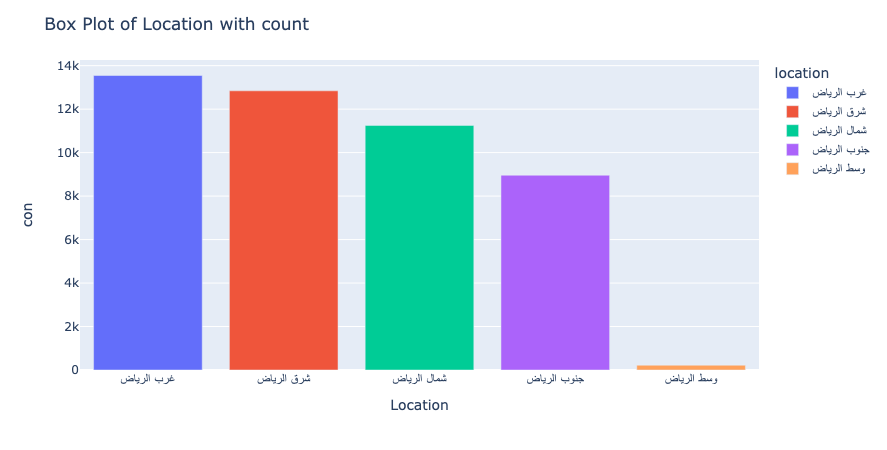 |

## villas distribution regarding the front of the Villa across the locations

The distribution of villas in Riyadh varies in terms of price across different locations, offering prospective buyers or renters a range of options to consider based on their budget and preferences.

    

## villas neighbourhoods distribution in each location 

Riyadh offers a diverse distribution of villa neighborhoods across the city. Each location has its own unique characteristics, villa counts, and average prices. Some neighborhoods boast a higher villa count, indicating a denser residential presence, while others have a more moderate count. The average prices of villas also vary, with some neighborhoods commanding higher prices due to their upscale amenities and popularity, while others offer more affordable options. These variations provide individuals with a range of choices to suit their preferences and budgetary requirements, ensuring that there is something for everyone in Riyadh's villa market.

### east side 
|                      |                        |
| ----------------------------- | ----------------------------- |
| 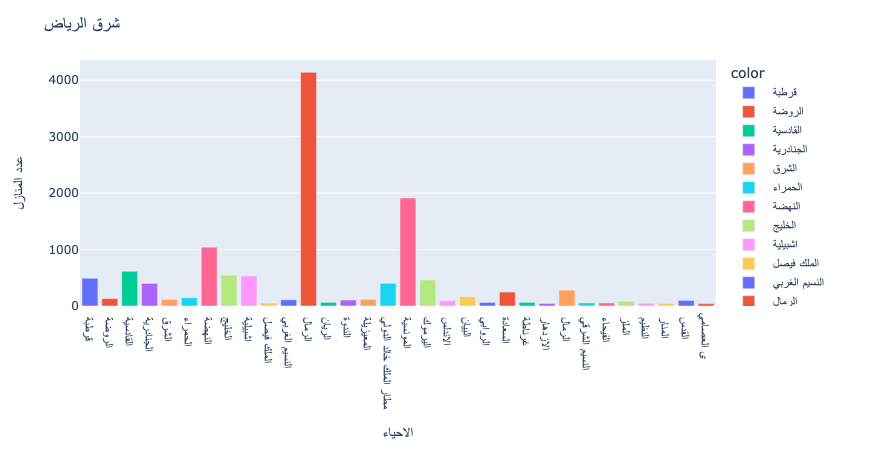 |  |

### west side
|                      |                        |
| ----------------------------- | ----------------------------- |
| 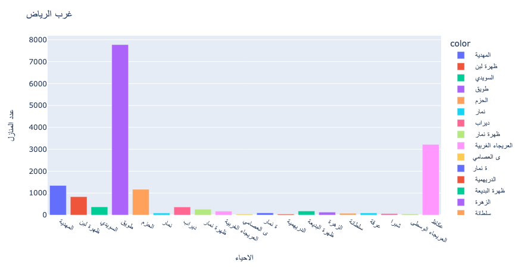 | 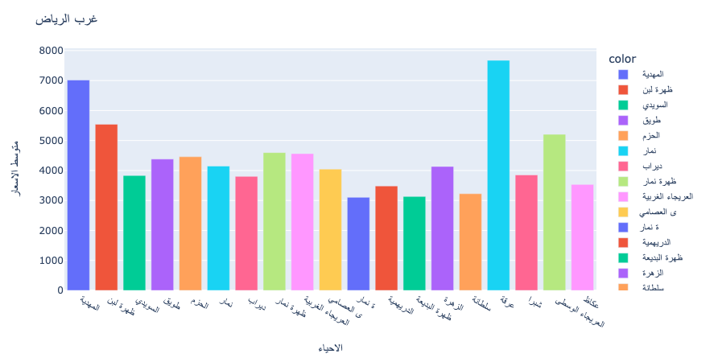 |

### south side 
|                      |                        |
| ----------------------------- | ----------------------------- |
| 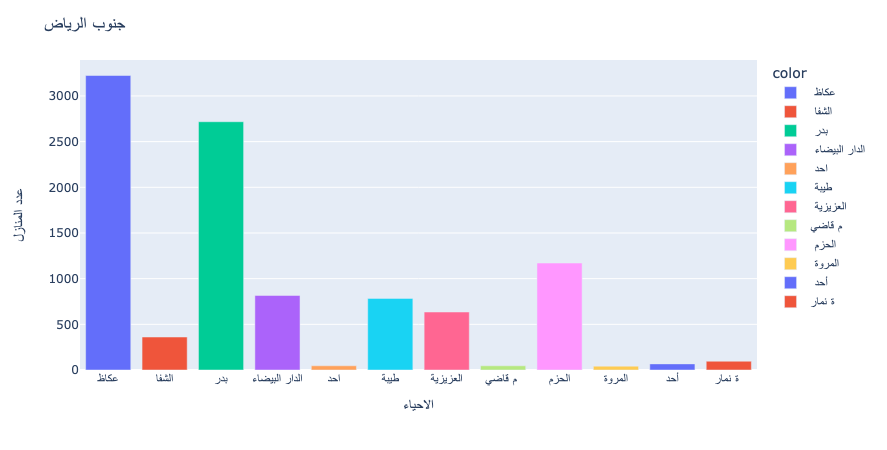 | 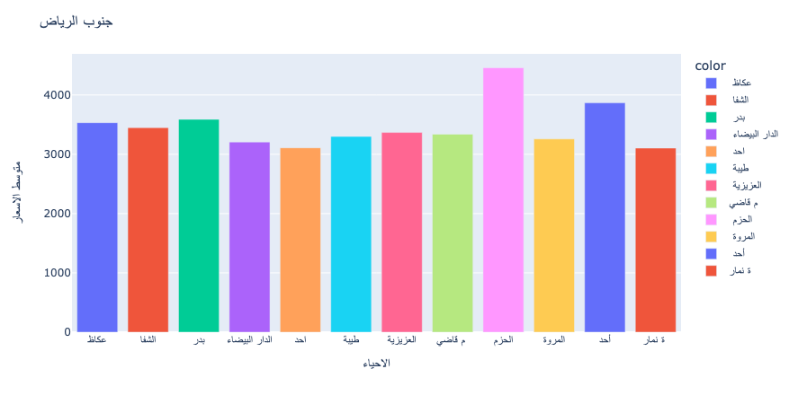 |

### north side
|                      |                        |
| ----------------------------- | ----------------------------- |
| 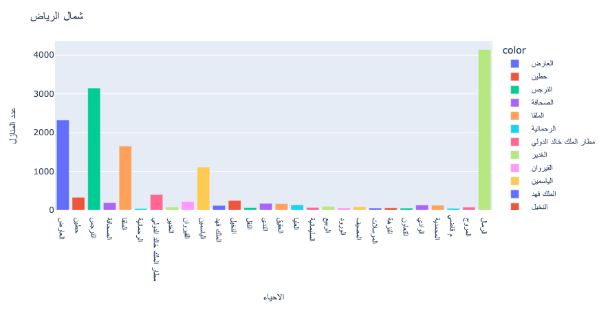 | 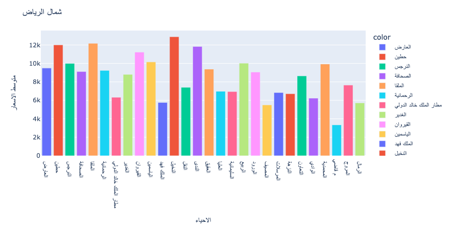 |

## Exploring Alnakheel Neighbourhood
In the beginning, to analyze Al Nakheel Neighbourhood we plot the matrix heatmap to identify the most affected features on the price.

|                      |                        |
| ----------------------------- | ----------------------------- |
|  | 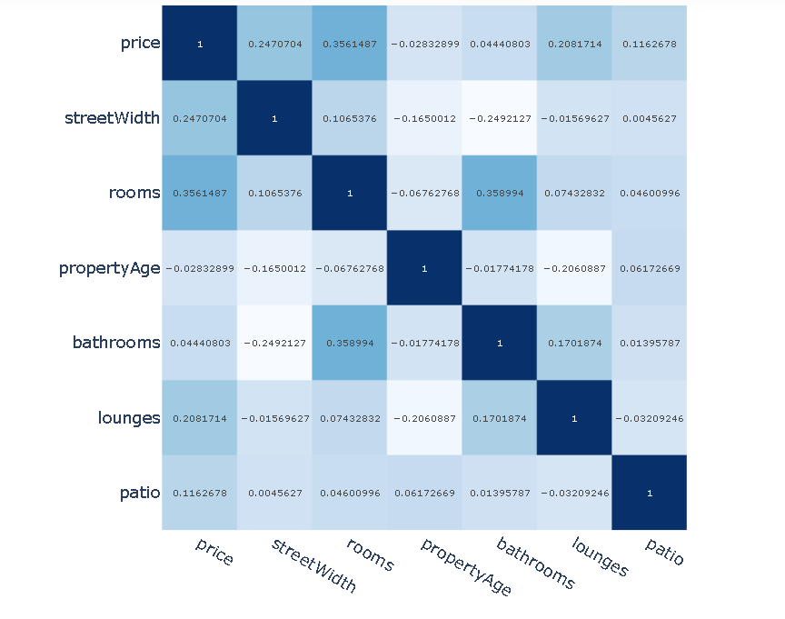 |

As shown above, the following features correlate most with the price: Elevator, Pool, Basement, Number of rooms, Front, and property age .for further analysis, we took each feature and plotted its relationship with the price.

The plot above shows that the correlation between the basement and the price is positive, which means that having a basement in the villa contributes to an increase in the price.

The same previous finding applies to the remaining features as in the following plots:
 
 
 
 

for the property age, the correlation in the heatmap plot showed the correlation is negative but the below blot shows the property age between 4-8 years affects the price in a positive way:

## Exploring Al Maseef Neighbourhood 
After exploring the highest number of villas in AlNakheel neighborhood, now scrolling to the lowest number of villas in AlMaseef neighborhood, we start our exploration by showing the correlation heatmap between features themselves, then focusing in the correlation between Prices and each features, and figure them in some different plots to show the relations independently. 

### Heatmap correlations for AlMaseef neighborhood: 
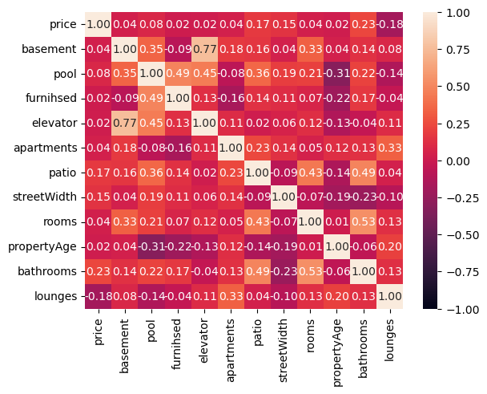

### Different features affected on Price: 
The price of a villa is affected by various features such as Street Width, Patios, number of rooms, Basement, and age of the property. By analyzing these features, we can gain insights into the factors that influence the price of a villa and help buyers and sellers make informed decisions about their purchase or sale.
#### Relation between basement presence and price:
The presence of a basement in a villa can also affect its price. Villas with basements are generally more expensive than those without, as they provide additional living space and storage.
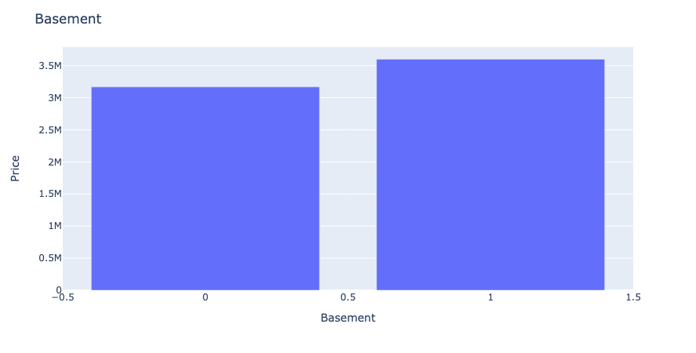

#### Relation between patio presence and price:
The presence of a patio in a villa can also affect its price. A patio is an outdoor living space that can be used for entertaining, dining, or relaxing, and it can add significant value to a property.
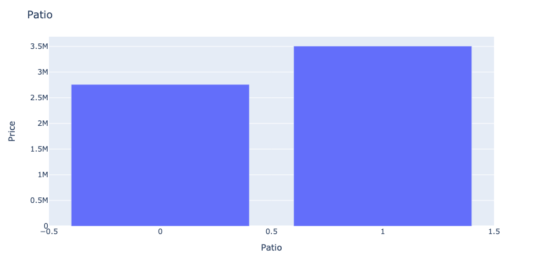

#### Relation between Property Age of Villa and price:
The age of a villa is an important factor that can influence its price. Generally, newer villas are more expensive than older ones, but in AlMaseef available dataset shows the correlation between Property age of villa and price is negatively, which villa has 20-30 property age has highest price than newest villas. 
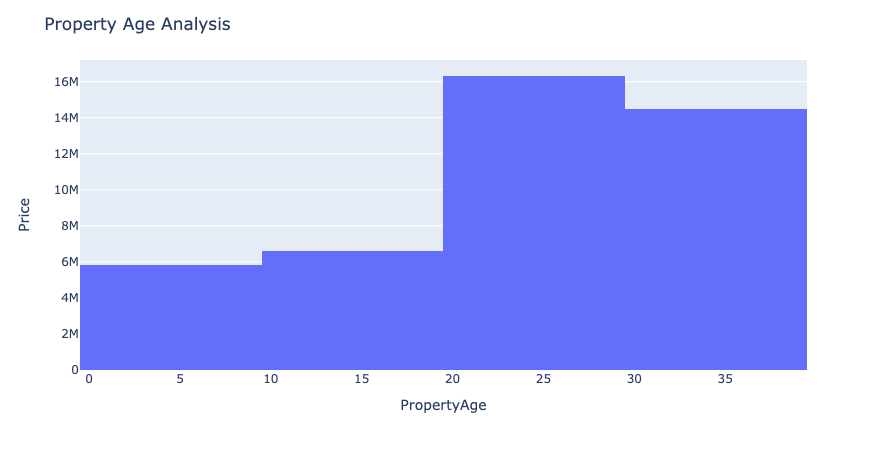

#### Relation between Front Type and price:
The front type of a villa can also impact its price, The front type can also affect the level of privacy and noise pollution experienced by the residents, which can impact the desirability of the property, and this figure shows this. 
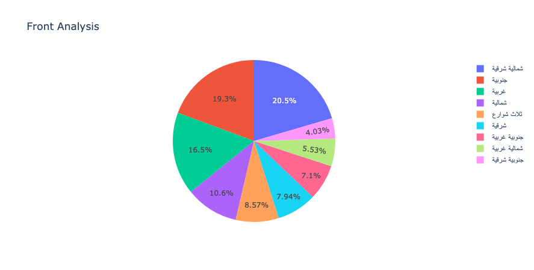

#### Relation between Street Width and price:
The street width of a villa can also impact its price. Generally, villas located on wider streets are more expensive than those on narrower streets. This is because wider streets provide more space and a greater sense of openness, which can be more desirable to potential buyers.

## Conclusion
In conclusion, our analysis of the Riyadh villas dataset has provided valuable insights into the real estate market in Riyadh, Saudi Arabia. We explored various features such as location, villa size, number of rooms, and price to understand the dynamics of the market and help buyers and sellers make informed decisions.

We found that the distribution of villas across different locations in Riyadh varies, with some areas having higher villa counts and higher average prices, while others offer more affordable options. By examining the distribution of villa features across locations, we identified trends in pricing based on the features of the villas.

Furthermore, we analyzed villa neighborhoods in each location, discovering variations in villa counts and average prices. This information can assist buyers in narrowing down their search and finding neighborhoods that align with their preferences and budget.

Additionally, we explored specific neighborhoods in detail, such as Al Nakheel and Al Maseef. Through correlation analysis, we identified features that strongly affect villa prices in these neighborhoods, including the presence of basements, patios, property age, front type, and street width. Understanding these relationships can help buyers and sellers gauge the value of a villa based on its features.

Overall, our analysis provides valuable insights into the Riyadh real estate market, empowering buyers and sellers with knowledge to make informed decisions. It is important to note that real estate markets are dynamic and subject to change, so continuous monitoring and analysis are necessary for up-to-date information.
